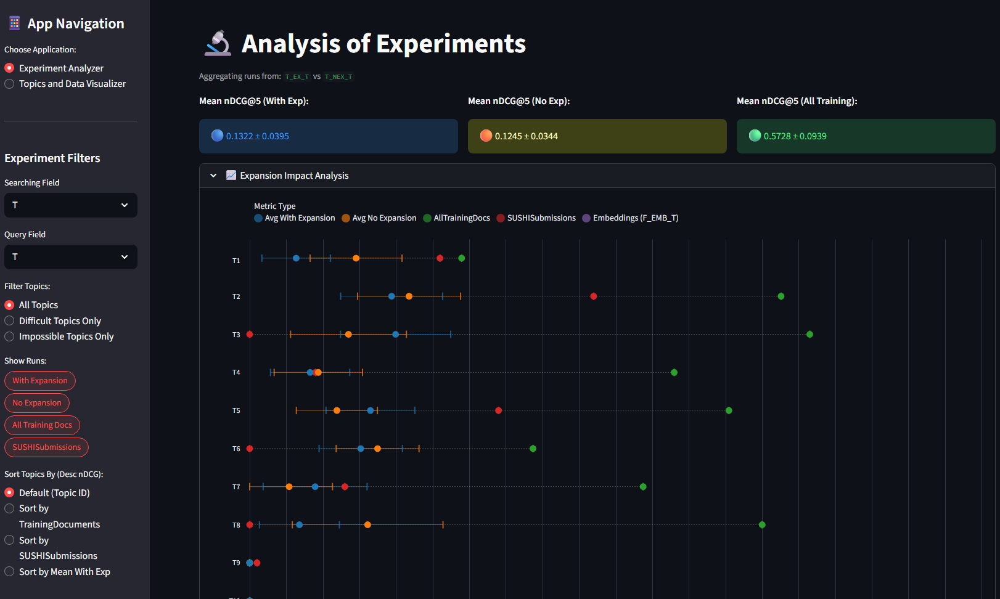
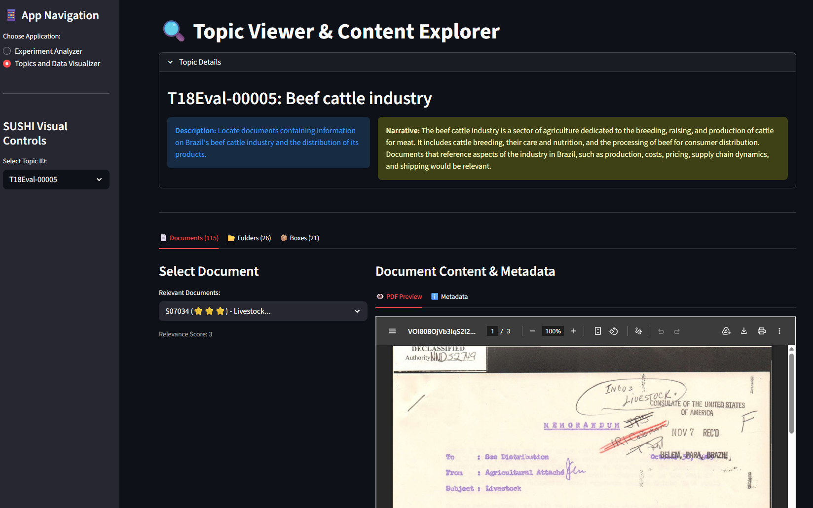

# SUSHI (Searching Unseen Sources for Historical Information) Experiment Runner and Visualizer

## Repository Setup

To run the applications correctly, it is necessary to reproduce the data structure locally, as large or sensitive files are not versioned in this repository (they are git-ignored).

```
├── all_runs/ # It contains runs that were already made from models  
├── data/                           
│   ├── folders_metadata/
│   │   └── FoldersV1.2.json
│   ├── items_metadata/
│   │   └── itemsV1.2.json          # ⚠️ Download Document metadata
│   ├── raw/                        # ⚠️ Download and Place the raw Box/Folder structure with PDFs here
│   │   └── A0001
│   │   └── A0002
│   │   └── A0003
│   │   └── ...
├── docs/
├── ecf/                            
├── qrels/                          
│   ├── dry-run-qrels/              
│   │   ├── Ntcir18SushiDryRunBoxQrelsV1.1.tsv
│   │   └── Ntcir18SushiDryRunFolderQrelsV1.1.tsv 
│   └── formal-run-qrels/          
│       ├── formal-box-qrel.txt
│       ├── formal-document-qrel.txt
│       └── formal-folder-qrel.txt
├── src/ # Experiment Run Generator
├── web_app/ # SUSHI visualizer
├── .gitignore
├── mkdocs.yml
├── README.md
└── requirements.txt                # Python dependencies
```

All files can be found at the [SUSHI Test Collection](https://sites.google.com/view/ntcir-sushi-task/test-collection):

- [FoldersV1.2.json](https://github.com/victorleaoo/SUSHI_Information_Retrieval_Archives/blob/main/FoldersV1.2.json)
- [itemsV1.2.json](https://drive.google.com/file/d/1c_hpR_lgdGeskXaNQTdCS7nO9s1R2NOb/view?usp=share_link)
- [raw](https://drive.google.com/file/d/1hA5FW0cNloi20coLlGvnv5wMap8ZN8YL/view?usp=sharing)

After downloading, reproduce the following steps:

1. Create a dir called ```data```;
2. Inside the dir ```data/items_metadata```, place the ```itemsV1.2.json``` file;
3. Inside the dir ```data/raw```, place the ```sushi-files.zip``` inside it and unzip it. After unziping, bring all folders out to the ```raw``` dir and delete the ```sushi-files``` folder and the ```sushi-files.zip``` file.

## SUSHI Experiment Runner

In order to help developers to run a set of different random generated Experiment Control Files, it was created a code that allows the follow workflow:

1. Load the documents and folders metadata;
2. Select the topic/query fields, search fields and if it is going to use the expansion technique or not (this last part being specific for the current model);
3. From a list of random seeds:
    - Generate a random Experiment Control File, with random selection of 5 documents from each box and a random selection of the topics for each data set.
    - Run the model for the ECF and generate the search results for the defined params;
    - Evaluate and save the models results.

The same workflow can be changed to run not for random seeds, but for AllTrainingDocuments.

The implemented model for the current workflow is the BM25F + Expansion technique developed in [Biting into SUSHI: The University of Maryland at NTCIR-18](https://research.nii.ac.jp/ntcir/workshop/OnlineProceedings18/pdf/ntcir/03-NTCIR18-SUSHI-OardD.pdf).

### How to Run

In order to run the SUSHI Experiment Runner, the follow steps must be followed:

1. **Install Python**: [https://www.python.org](https://www.python.org).
2. **Install Python libraries**: run the command ```pip install -r requirements.txt```. It is recommended to use a [virtualenv](https://virtualenv.pypa.io/en/latest/user_guide.html) or a [conda](https://www.anaconda.com/docs/getting-started/miniconda/install) env.
3. **Install Java for Pyterrier**: [https://pyterrier.readthedocs.io/en/latest/troubleshooting/java.html](https://pyterrier.readthedocs.io/en/latest/troubleshooting/java.html)
4. **Setup the run parameters**: in the ```src/random_run_generator.py```, set the **queryFields**, **searchFields**, **expansion** and **random** params to run the model desired.
5. If you're running on Windows, change the ```java_home```, in the ```src/lastest_runs/run_refactor.py``` file (line 82);
6. **Run the run generator**: execute the code with ```python src/random_run_generator.py```. **It is important to run outside the src folder, in order for the paths creation to work**.

**IMPORTANT NOTE**: the code doesn't automatically delete the terrierindex folder that is created for each run, therefore, it is necessary to **manually delete it after the run generator stops** running.

## SUSHI Visualizer

The SUSHI Visualizer is a web application developed using Streamlit (Python library). It serves as an interactive dashboard for researchers participating in the SUSHI task, allowing them to benchmark their models, analyze performance stability, and explore the underlying dataset.

The tool is designed to bridge the gap between raw metric files and actionable insights, offering features like confidence interval visualization, topic-by-topic breakdowns, and dynamic filtering.

The SUSHI visualizer has two main screens:

- **Experiment Analyzer**: performance benchmarking;
- **Topics and Data Visualizer**: dataset exploration.

### Experiment Analyzer



The Experiment Analyzer is the core benchmarking dashboard. It aggregates results from multiple randomized runs to provide a statistically robust view of model performance. As shown in the interface, this screen is divided into four key areas:

1. **Settings Menu:** filters and sorts.
2. **Overall Model Metrics:** high-level summary of the model's global performance across all topics (mean nDCG@5 with Confidence Intervals).
3. **Topic Results Chart:** interval plot that show the results (mean nDCG@5 with Confidence Intervals) of the filtered models for all topics.
    - **Points**: Represent the mean score for a specific run model;
    - **Error Bars**: Horizontal lines indicating the confidence interval for that specific topic;
    - **Baselines**: Includes comparison points for "All Training Documents" (Green) and official "SUSHISubmissions" (Red) to benchmark against known standards.
4. **Runs Results Table:** lists the raw metric values for every run and topic, allowing for granular inspection of the data used to generate the charts.

For the Experiment Analyzer to function, the experiment results must be stored in the all_runs directory following this strict naming convention \<SEARCHFIELDS>_\<TECHNIQUE>\<TOPICFIELDS>, in which:

- **SEARCHFIELDS:** these are the search fields used in the model. *T*itle, *F*older Label, *S*ummary and *O*CR.
- **TECHNIQUE:** these are different techniques that can be approached for the model. *EX*pansion, *N*ot *EX*pansion and *EMB*eddings.
- **TOPICFIELDS:** these are the topic fields used for the query. *T*itle, *D*escription and *N*arrative.

Inside each folder, it's important to have a few different set of folders in order for the visualizer to show the all results in the sections:

- **\<RUNNAME>_TopicsFolderMetrics.json**: these are the topics results for different runs of the same model in different generated Experiment Control File.
- **AllTrainingDocuments_TopicsFolderMetrics.json**: these are the topics results for the model run in a Experiment Control File that have all documents at the Training Documents set.
- **model_overall_stats.json**: different runs model global mean results across all topics.
- **all_training_model_overall_stats.json**: all training documents model global mean results across all topics.
- **topics_mean_margin.json**: different runs model mean results for each topic.

Therefore, with all the information in the files present, the Experiment Analyzer can show all the data and charts necessary for the user to study the results of their models.

### Topics and Data Visualizer



The other screen is focused in showing the topics and the documents/folders that compose the task. This screen has a filter for topics and, after a topic is selected, there are three different tabs:

- **Documents:** it shows all the documents that have a value different than 0 in the qrels. With a document selected, it is possible to see all of its metadata, in addition to the PDF file.
- **Folders:** it shows all folders that have a value different than 0 in the qrels. With a folder selected, it is possible to see all of its metadata.
- **Boxes:** it shows all boxes that have a value different than 0 in the qrels. The boxes doesn't have any metadata related to them.

The Topics and Data Visualizer allows the user to understand about the data that they're working on with the topics for search.

### How to Run

In order to run the SUSHI Experiment Runner, the follow steps must be followed:

1. **Install Python**: [https://www.python.org](https://www.python.org).
2. **Install Python libraries**: run the command ```pip install -r requirements.txt```. It is recommended to use a [virtualenv](https://virtualenv.pypa.io/en/latest/user_guide.html) or a [conda](https://www.anaconda.com/docs/getting-started/miniconda/install) env.
3. **Download all necessary files**: make sure to follow all the steps in the **Repository Setup** section of this README file.
4. **Run Experiments in the necessary format**: for experiments to appear, it's necessary to have the ```all_runs``` folder with the runs folders inside it in the ```\<SEARCHFIELDS>_\<TECHNIQUE>\<TOPICFIELDS>``` format.
5. **Run the Streamlit application**: now run the application and access it in the browser: ```streamlit run web_app/app_sushi.py```.