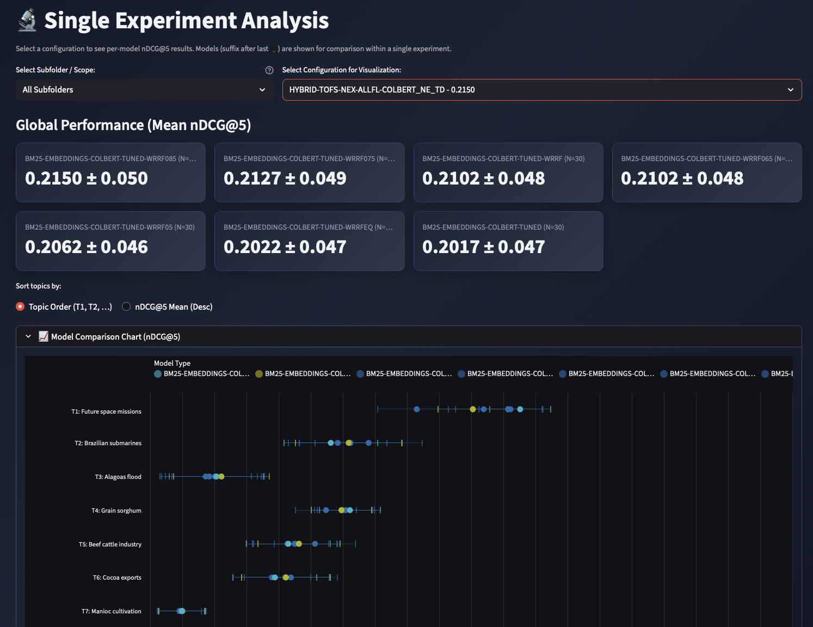
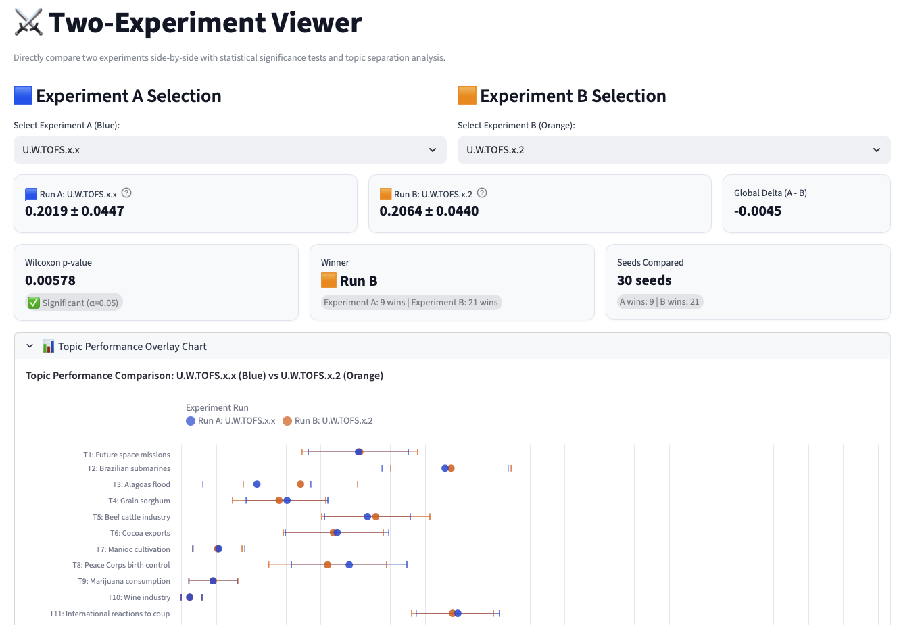
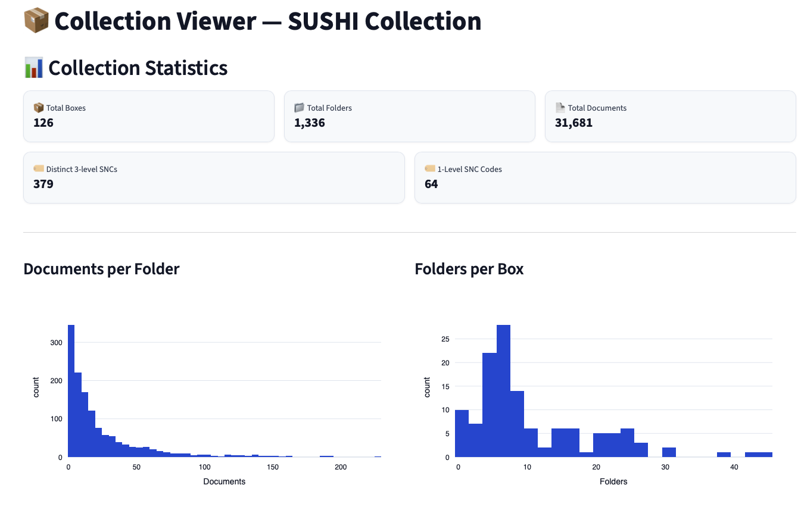
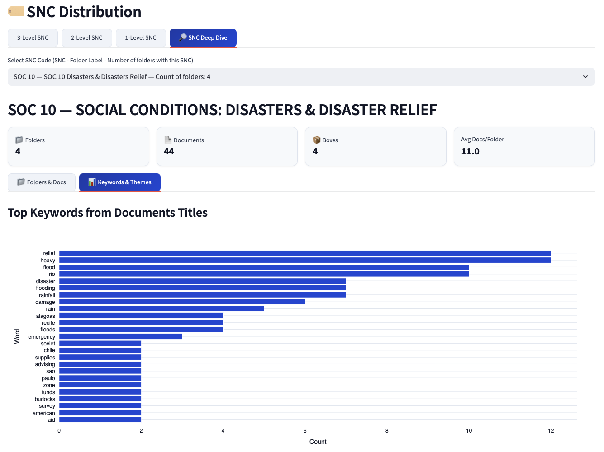
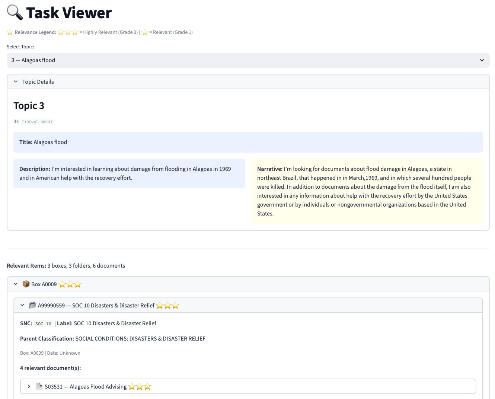
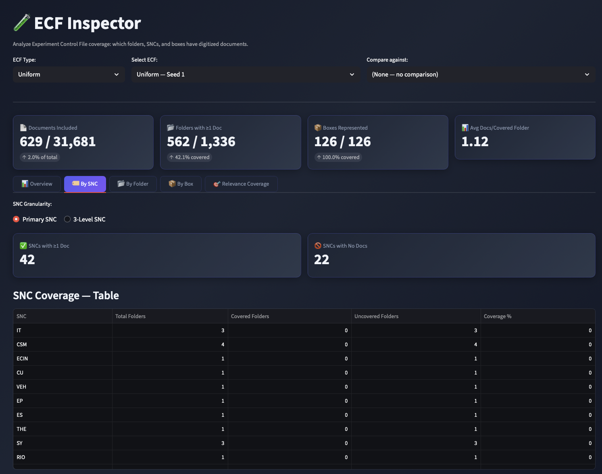
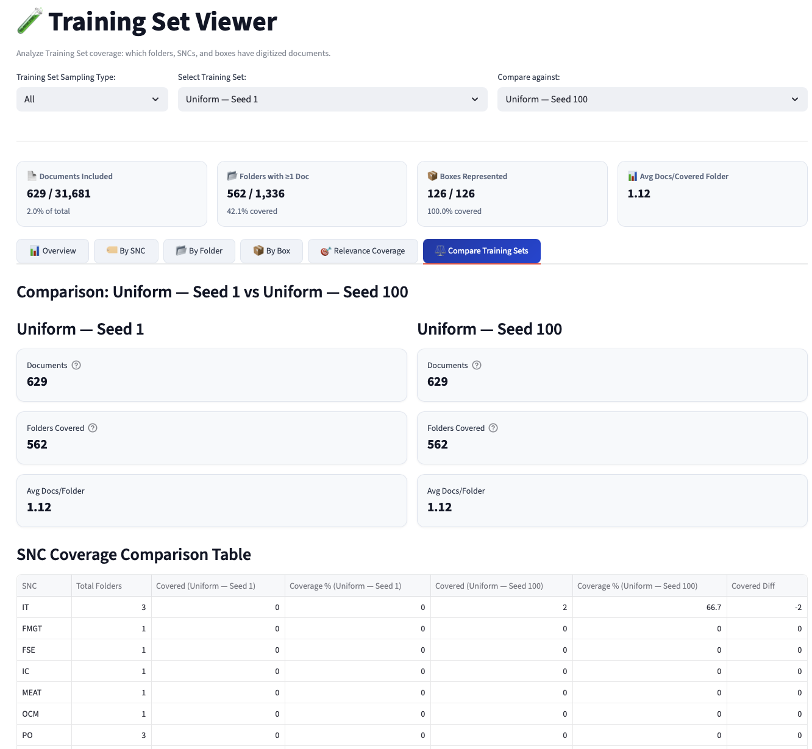

# SUSHI (Searching Unseen Sources for Historical Information) Test Collection and Experiments

## Index
- [About the Collection](#about-the-collection)
    - [Data Hierarchy: Boxes, Folders, and Documents](#data-hierarchy-boxes-folders-and-documents)
    - [Folder Metadata](#folder-metadata)
    - [Documents Metadata](#documents-metadata)
    - [Topics](#topics)
    - [Relevance judgment (QRels)](#relevance-judgment-qrels)
    - [Experiment Control Files (ECFs)](#experiment-control-files-ecfs)
- [Repository Setup](#repository-setup)
    - [Adding missing files](#adding-missing-files)
- [SUSHI Experiment Running](#sushi-experiment-running)
    - [1. System/File Architecture](#1-systemfile-architecture)
    - [2. The Experiment Workflow (Step-by-Step)](#2-the-experiment-workflow-step-by-step)
    - [3. Output Structure](#3-output-structure)
    - [4. Usage Example](#4-usage-example)
    - [5. Hybrid Models (Combining two different techniques with RRF) - `hybrid_models.py`](#5-hybrid-models-combining-two-different-techniques-with-rrf---hybrid_modelspy)
- [SUSHI Visualizer Web Application](#sushi-visualizer-web-application)
    - [Experiment Analyzer](#experiment-analyzer)
    - [Topics and Data Visualizer](#topics-and-data-visualizer)
    - [Setup Experiments for the Visualizer](#setup-experiments-for-the-visualizer)
    - [How to Run](#how-to-run)

---

This repository presents the SUSHI Test Collection and provides a walk-through on how to access and use it. 

It also houses the code required to reproduce initial experiments, as well as a Python Streamlit web application for data and experiment visualization.

## About the Collection

The SUSHI Collection seeks to facilitate the development of archival Information Retrieval (IR). In many archival contexts, describing every individual document with metadata is impractical; often, the finest-grained descriptions available are for sets of boxes and folders, which may contain sparsely digitized documents. 

Consequently, the most common search task in an archive is not to find specific documents directly, but to identify *where* in the repository to look for them. Searchers typically identify promising boxes or folders, request them, and then physically or digitally browse the contents to find relevant information.

The first version of the NTCIR-18 SUSHI Collection is available at:  
[https://sites.google.com/view/ntcir-sushi-task/test-collection](https://sites.google.com/view/ntcir-sushi-task/test-collection)

### Data Hierarchy: Boxes, Folders, and Documents

The raw data structure follows a strict hierarchy representing the physical archival organization. The dataset contains **31,684 digitized documents**, stored in **1,336 folders** and **126 boxes**.

* **Download:** The raw box/folder/document structure is available [here](https://drive.google.com/file/d/1hA5FW0cNloi20coLlGvnv5wMap8ZN8YL/view?usp=sharing).
* **Format:** All documents are provided as PDF files.

**The Hierarchy:**

1. **Box:** Identified by a unique identifier (e.g., `N1234`).
2. **Folder:** Stored within a box, identified by a unique folder identifier (e.g., `N12345678`).
3. **Document:** Stored within a folder, identified by a unique SUSHI document identifier (e.g., `S12345.pdf`).

**Directory Structure:**

The test collection file system mirrors this hierarchy: one directory for each Box $\rightarrow$ one subdirectory for each Folder $\rightarrow$ one PDF file for each digitized Document. 

> **Note:** The PDF files contain embedded (uncorrected) OCR text, allowing the users of the collection to utilize raw text features in their experiments.

### Folder Metadata

Raw archival folder titles are often codes (e.g., `POL 15-1`). To make these searchable, we enrich them using the **Subject-Numeric Code (SNC)** systems from [1963](https://www.archives.gov/files/research/foreign-policy/state-dept/finding-aids/records-classification-handbook-1963.pdf) and [1965](https://www.archives.gov/files/research/foreign-policy/state-dept/finding-aids/dos-records-classification-handbook-1965-1973.pdf).

For NTCIR, it was provided the FoldersV1.2.json file, however additions were provided in order to have more fields (version FoldersV1.3.json): the labels from 1965 and 1963 (not only the newest one available); the raw version of scope note; the truncated version of scope note; the parent snc (if possible) and its recursive expansion.

This enrichment is handled by the `FolderLabelConstructor` class ([src/data_creation/SNCLabelTranslate.py](https://github.com/victorleaoo/SUSHI_Information_Retrieval_Archives/blob/main/src/data_creation/SNCLabelTranslate.py)), merging raw folder data with the SNC Translation Table.

The file can be found at [FoldersV1.3.json](https://github.com/victorleaoo/SUSHI_Information_Retrieval_Archives/blob/main/data/folders_metadata/FoldersV1.3.json).

* **Input Source:** [SncTranslationV1.3.xlsx](https://github.com/victorleaoo/SUSHI_Information_Retrieval_Archives/blob/main/data/folders_metadata/SncTranslationV1.3.xlsx)
    * `SNC`: The code (e.g., `POL 1`).
    * `1965`: Label from the 1965 classification (Preferred).
    * `1963`: Label from the 1963 classification (Fallback).
    * `Scope Note`: Description of the category's inclusion/exclusion criteria.

**Output Fields (JSON):**

| Field | Description | Purpose |
| :--- | :--- | :--- |
| `label1965` | Literal text from 1965 column. | Preferred term source. |
| `label1963` | Literal text from 1963 column. | Fallback source. |
| `main_title` | Resolved primary label (1965 or 1963). | Core display name for the folder. |
| `raw_scope` | Full scope note text. | Provides maximum context. |
| `scope_truncated` | Cleaned scope note. "Stopper Keywords" (e.g., `SEE`, `Exclude`) are used to cut off negative definitions. | High-precision context; removes confusing negative keywords. |
| `parent` | SNC code of the immediate parent. | hierarchy traversal. |
| `label_parent_expanded` | Full semantic path string. | e.g., Resolves `POL 15-1` to "POLITICAL -> GENERAL" rather than just "General". |

### Documents Metadata

The **Document Metadata** file aggregates information available for each document, sourcing data from NARA and Brown University records. It can be loaded at [itemsV1.2.json](https://drive.google.com/file/d/1c_hpR_lgdGeskXaNQTdCS7nO9s1R2NOb/view?usp=share_link).

* **Input Source:** [SubtaskACollectionMetadataV1.1.xlsx](https://github.com/victorleaoo/SUSHI_Information_Retrieval_Archives/blob/main/data/items_metadata/SubtaskACollectionMetadataV1.1.xlsx)
    * Contains SUSHI unique identifiers.
    * Merges available original NARA and Brown metadata.

**Output Fields (JSON):**

| Field | Description |
| :--- | :--- |
| `Sushi Box` | The SUSHI unique ID for the box. |
| `Sushi Folder` | The SUSHI unique ID for the folder. |
| `Sushi File` | The SUSHI unique ID for the document (including `.pdf` extension). |
| `NARA <metadata>` | The set of raw fields provided by NARA. |
| `Brown <metadata>` | The set of raw fields provided by Brown. |
| `date` | The resolved date of the file (prioritizes Brown metadata if available, falls back to NARA). |
| `title` | The resolved title of the file (prioritizes Brown metadata if available, falls back to NARA). |
| `ocr` | A list containing the OCR text for each page. Generated primarily using ABBYY FineReader. |
| `summary` | A generated summary of the document content produced by GPT4o. |

### Topics

The [Topics File](src/data_creation/topics_output.txt) contains 45 information needs. Each topic includes:

* **ID:** Unique identifier.
* **Title:** A short, web-search-style query.
* **Description:** A single sentence succinctly expressing the information need.
* **Narrative:** A paragraph providing detailed criteria for relevance assessment.

### Relevance judgment (QRels)

Relevance assessments are provided at three granularity levels in the `qrels/formal-run-qrels/` directory:

- [Box Qrels](https://github.com/victorleaoo/SUSHI_Information_Retrieval_Archives/blob/main/qrels/formal-box-qrel.txt);
- [Folder Qrels](https://github.com/victorleaoo/SUSHI_Information_Retrieval_Archives/blob/main/qrels/formal-folder-qrel.txt);
- [Document Qrels](https://github.com/victorleaoo/SUSHI_Information_Retrieval_Archives/blob/main/qrels/formal-document-qrel.txt).

**Format:**

Each line maps a topic to a Box/Folder/Document ID with a relevance score:

* **3:** Highly Relevant
* **1:** Somewhat Relevant
* **0:** Not Relevant

*(Unjudged items are omitted from the files).*

**Note on Documents Qrels Score Normalization:**

The [raw judgments for documents](./qrels/OLD-formal-document-qrel.txt) contained a wider range of labels. These were normalized to the standard 3-point scale as follows:

| Original Assessor Label | Final Qrels Score | Meaning |
| :--- | :--- | :--- |
| **4** | **3** | Highly Relevant |
| **3** | **1** | Relevant |
| **1, 2** | **0** | Not Relevant |
| **-1** | *(Removed)* | Not judgeable |

### Experiment Control Files (ECFs)

The **Experiment Control File (ECF)** serves the role of a standard "Topics" file in TREC evaluations but is adapted for the SUSHI task. Real-world archives have limited digitization. SUSHI simulates this by explicitly defining which documents are "visible" (digitized/training data) to the system for a given topic.

**Structure:**

Each ECF defines specific **Experiment Sets**. An experiment set maps a list of **Topics** to a specific list of **TrainingDocuments**.

* **TrainingDocuments:** A slash-delimited path (`SushiBox/SushiFolder/SushiFile`, e.g., `N1234/N12345678/S12345.pdf`). These are the only documents the system is allowed to "read" to learn the relevance features for the associated topics.
* **Topics:** The queries for which the system must find *other* relevant folders (containing documents *not* in the training set).

**ECF Conditions:**

We provide [ECFs](https://github.com/victorleaoo/SUSHI_Information_Retrieval_Archives/tree/main/ecf/random_generated) covering three different experimental conditions:

1.  **[All Training Documents (No Mask)](https://github.com/victorleaoo/SUSHI_Information_Retrieval_Archives/blob/main/ecf/random_generated/ECF_ALL_TRAINING_SET.json):** * ECF containing all available training documents for all topics.
2.  **Random (Uniform):** * ECF simulating a uniform digitization strategy (e.g., 5 documents per box), selected via different random seeds. These are the ECFs that have the name such as *ECF_RANDOM_seed.json*.
3.  **Uneven (Skewed):** * ECF simulating a skewed distribution of digitized documents per box. These are the ECFs that have the name such as *ECF_UNEVEN_Random_Seed_seed.json*.
    * The distribution logic is detailed in [src/RGdistribution.xlsx](https://github.com/victorleaoo/SUSHI_Information_Retrieval_Archives/blob/main/src/RGdistribution.xlsx).

*The ECF creation logic is located at [create_random_ecf](https://github.com/victorleaoo/SUSHI_Information_Retrieval_Archives/blob/main/src/data_loader.py#L77).*

---

## Repository Setup

To run the applications correctly, it is necessary to reproduce the data structure locally, as large or sensitive files are not versioned in this repository (they are git-ignored).

```
├── all_runs/ # It contains runs that were already made from models  
├── data/                           
│   ├── folders_metadata/
│   │   └── FoldersV1.3.json
│   ├── items_metadata/
│   │   └── itemsV1.2.json  # ⚠️ Download Document metadata
│   ├── raw/                # ⚠️ Download and Place the raw Box/Folder structure with PDFs here
│   │   └── A0001
│   │   └── A0002
│   │   └── A0003
│   │   └── ...
├── ecf/                            
├── qrels/                          
│   ├── formal-box-qrel.txt
│   ├── formal-document-qrel.txt
│   └── formal-folder-qrel.txt
├── src/     # Experiment Run Generator
├── web_app/ # SUSHI visualizer
├── .gitignore
├── README.md
└── requirements.txt
```

### Adding missing files

All files can be found at the [SUSHI Test Collection](https://sites.google.com/view/ntcir-sushi-task/test-collection):

- [itemsV1.2.json](https://drive.google.com/file/d/1c_hpR_lgdGeskXaNQTdCS7nO9s1R2NOb/view?usp=share_link)
- [raw](https://drive.google.com/file/d/1hA5FW0cNloi20coLlGvnv5wMap8ZN8YL/view?usp=sharing)

After downloading, reproduce the following steps:

1. Create a dir called ```data```;
2. Inside the dir ```data/items_metadata```, place the ```itemsV1.2.json``` file;
3. Inside the dir ```data/raw```, place the ```sushi-files.zip``` inside it and unzip it. After unziping, bring all folders out to the ```raw``` dir and delete the ```sushi-files``` folder and the ```sushi-files.zip``` file.

---

## [SUSHI BAR Web Application](https://tinyurl.com/sushisigir)

The **SUSHI BAR** (SUSHI Visualizer) is the main interactive interface for analyzing experiment runs and exploring the archival collection. Built with Streamlit, it combines experiment benchmarking, task inspection, metadata exploration, and training set analysis in a single application. The app is launched from the [web_app/app_sushi.py](web_app/app_sushi.py) entry point and can be accessed at [https://tinyurl.com/sushisigir](https://tinyurl.com/sushisigir).

The interface is organized around a left-side navigation menu (**SUSHI BAR**), where each entry exposes a different analysis workflow.

### Side Menu Navigation

The navigation menu contains six main sections:

1. **📦 Collection Viewer**
   - A collection exploration page for understanding dataset structure beyond retrieval metrics.
   - Includes:
     - collection statistics such as number of folders, documents, boxes, and SNCs;
     - histograms for documents per folder and folders per box;
     - SNC distribution views at three granularity levels (3-Level, 2-Level, and 1-Level primary SNC);
     - a deep-dive view to inspect folder and document content by selected SNC;
     - document analysis tools to browse documents by SNC or by folder.

2. **🔍 Task Viewer**
   - Lets the user browse the 45 evaluation topics (T1–T45).
   - Displays topic details with a clear topic number header (e.g., **Topic 1**), dedicated title card, description, and narrative.
   - Builds a hierarchical view of the relevant structure: **Boxes → Folders → Documents**.
   - Each item is shown with star-based relevance grades, scope notes, summaries, and OCR previews.

3. **🧪 Training Set Viewer**
   - Focuses on the training sets (sampling conditions), which define which documents are digitized and visible during model index creation.
   - Provides multiple views for understanding coverage:
     - overall document distribution histograms;
     - coverage by SNC;
     - coverage by folder;
     - coverage by box;
     - relevance coverage for the 45 evaluation topics;
     - direct side-by-side comparison between two training sets (`⚖️ Compare Training Sets`).

4. **🔬 Single Experiment Viewer**
   - Benchmarks a single experiment run configuration.
   - Features:
     - **Global Performance Card**: displays mean nDCG@5 and margin of error (95% CI);
     - **Topic Performance Chart**: interactive dumbbell chart showing per-topic mean nDCG@5 and confidence intervals;
     - **Seed Variance**: horizontal box plot displaying cross-seed nDCG@5 distribution per topic with clean 3-decimal hover tooltips.

5. **⚔️ Two-Experiment Viewer**
   - Direct side-by-side comparison of two experiment runs (**Experiment A** vs **Experiment B**).
   - Includes:
     - **Side-by-Side KPIs & Delta**: global mean nDCG@5 metrics and exact performance delta;
     - **Wilcoxon Signed-Rank Test**: statistical significance test results (p-value, winner, win counts);
     - **Overlay Comparison Chart**: side-by-side topic overlay dumbbell chart;
     - **Topic Separation Analysis**: categorized breakdown of topics into **Better** (≥ +10%), **About Equal** (within ±10%), and **Worse** (≤ -10%).

6. **📖 How-To Guide — SUSHI BAR**
   - Comprehensive interactive documentation introducing:
     - the SUSHI task and box/folder/document hierarchy;
     - **SNC (Subject-Numeric Code)** classification and its 3 levels of granularity (1-Level, 2-Level, 3-Level), explaining that each folder can have an SNC code attached to it;
     - **Training Sets** (Uniform, Skewed, All Docs);
     - **nDCG@5** evaluation metric details, clarifying that folders are evaluated based on containing one or more relevant documents;
     - relevance grades (Grade 3 = Highly Relevant, Grade 1 = Relevant).

### Single and Two-Experiment Viewers in Detail

These pages answer core research questions: *“Which model performs better?”* and *“Why?”*.

#### Inputs and experiment selection

The app discovers available experiment results from the [all_runs](all_runs) directory. Users select:

- **Single Experiment Viewer**: select an experiment from the dropdown menu to inspect its global score, topic dumbbell chart, and cross-seed variance.
- **Two-Experiment Viewer**: select **Experiment A (Blue)** and **Experiment B (Orange)** to perform head-to-head comparative analysis.

<p align="center">
  
</p>

<p align="center">
  
</p>

#### Run naming convention

Experiment folders follow a **5-Element Dotted Notation**:

```text
{Sample}.{Ranker}.{Fields}.{LabelSearch}.{ScorePropagation}
```

- **Sample**: `U` (Uniform 5/box), `K` (Skewed), `A` (All Docs)
- **Ranker**: `B` (BM25F), `C` (ColBERT), `E` (Embeddings), `W`/`X`/`Y`/`Z` (RRF Ensembles)
- **Fields**: 4-char string (`T` Title, `O` OCR, `F` Folder Label, `S` Summary, `-` Unused)
- **LabelSearch**: `L` (Weighted RRF with Label search), `x` (None)
- **ScorePropagation**: `1`/`2` (SNC Score Propagation depth 1 or 2), `x` (None)

For example, `U.B.T---.x.x` indicates Uniform sampling, BM25F ranker, Title field only, no label search, and no score propagation.

### Collection Viewer in Detail

This section is intended for dataset exploration rather than model benchmarking. It helps explain the collection conditions behind retrieval metrics.

#### What is shown in collection statistics

The opening view displays:

- total folders, documents, and boxes;
- how many distinct SNCs exist at different levels (3-Level, 2-Level, 1-Level);
- how many folders contain scope notes;
- distributional summaries such as OCR page counts and the number of documents per folder.

<p align="center">
  
</p>

#### What is shown in SNC exploration views

The SNC tabs provide a structured view of the archival classification system:

- **3-Level SNC**: the most detailed view, useful for fine-grained analysis.
- **2-Level SNC**: a middle layer that reveals broader semantic clusters.
- **1-Level (Primary)**: a top-level overview of the main classification families (`POL`, `AGR`, `DEF`, etc.).

<p align="center">
  
</p>

### Task Viewer in Detail

The Task Viewer is designed for qualitative inspection of the relevance judgments and the archival context behind each topic.

#### What is shown on this page

For a selected topic, the page displays:

- a clean **Topic {number}** header with dedicated title card, description, and narrative;
- a summary of how many relevant boxes, folders, and documents are associated with the topic;
- a hierarchical expansion of the relevant structure:
  - box-level grouping;
  - folder-level metadata and scope notes;
  - document-level summaries and OCR previews.

<p align="center">
  
</p>

### Training Set Viewer in Detail

The Training Set Viewer focuses on the experimental conditions used to train models. It answers: *Which documents were visible to the model during training, and how much of the collection was available to learn from?*

#### What is shown in coverage views

- **Overview**: histogram of documents per covered folder.
- **By SNC**: table of coverage by classification code, including counts of SNCs with and without documents.
- **By Folder**: detailed inspection of folders covered by the training set.
- **By Box**: box-level coverage statistics.
- **Relevance Coverage**: how much of the relevant-folder set across the 45 topics is covered by the training set.
- **Compare Training Sets**: side-by-side view to compare training visibility between two experimental settings.

<p align="center">
  
</p>

<p align="center">
  
</p>

### Setup for New Experiments and Visualizer Inputs

The visualizer is dynamic and discovers available experiment results from the filesystem. To add a new run, make sure that output files follow the expected structure under the [all_runs](all_runs) directory.

#### Required directory layout

```text
ProjectRoot/
├── all_runs/
│   ├── U.B.T---.x.x/
│   └── U.W.TOFS.L.2/
│       ├── model_overall_stats.json
│       ├── topics_mean_margin.json
│       ├── topics_relevant_count_stats.json
│       ├── Random1_TopicsFolderMetrics.json
│       └── ...
```

#### Required files

- `model_overall_stats.json`: global mean nDCG and margin of error.
- `topics_mean_margin.json`: per-topic statistics used by the dumbbell chart.
- `topics_relevant_count_stats.json`: relevance counts used by comparison views.
- `Random{SEED}_TopicsFolderMetrics.json`: one file per seed for detailed analysis.

#### Naming convention

Use the 5-element dotted pattern for experiment folder names:

```text
{Sample}.{Ranker}.{Fields}.{LabelSearch}.{ScorePropagation}
```

Examples:
- `U.B.T---.x.x`: Uniform sampling, BM25F ranker, Title only, no label search, no score propagation.
- `U.W.TOFS.L.2`: Uniform sampling, Weighted RRF ranker, all document fields, Label search enabled, SNC propagation depth 2.

#### Optional color registration

If you add a new model name and want it to appear with a specific color in the charts, add it to the `COLOR_MAP` dictionary in [web_app/utils_experiments_viz.py](web_app/utils_experiments_viz.py).

### How to Run

To run the application locally:

1. Install Python from [https://www.python.org](https://www.python.org).
2. Install the dependencies with:

   ```bash
   pip install -r requirements.txt
   ```

3. Follow the repository setup steps described earlier in this README so the required data files are available.
4. Start the Streamlit app from the [web_app](web_app) directory:

   ```bash
   streamlit run app_sushi.py
   ```