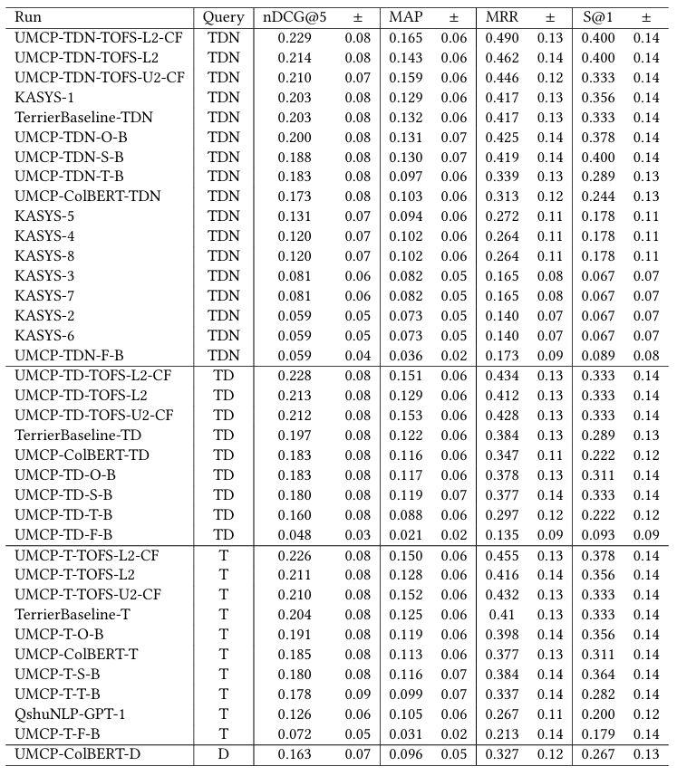

# Develop Solutions for NTCIR SUSHI

## [KASYS at the NTCIR-18 SUSHI Task](https://research.nii.ac.jp/ntcir/workshop/OnlineProceedings18/pdf/ntcir/02-NTCIR18-SUSHI-FujimakiH.pdf)

### Hypothesis

Use the hierarchial structure of File, Folder and Box, aggregating the metadata for each one. It states that the aggregation from lower to higher level can enrich the search.

### Experiments

It used different retrieval models: BM-25, E5 (embedding), and ColBERT (embedding). Two different strategies of searching: "Each" (each metadata field searched independently) and "Merge" (metadate concatenated and searched).

For each query componente (tdn) were performed searchs at each level (box, folder and item) to have the score of the level for the query. Finally, it is calculated the scores for each folder with weights for each level.

<figure markdown="span">
  { width="300" }
  <figcaption>Kasys Solution Equation</figcaption>
</figure>

### Results

BM25 with Merge got the best results. However, the BM25 Baseline had better response.

Dense models were bad because the concatenation became noise, which is probably the biggest problem.

## [QshuNLP’s Participation in the SUSHI: Systems and Analysis of the Results](https://research.nii.ac.jp/ntcir/workshop/OnlineProceedings18/pdf/ntcir/04-NTCIR18-SUSHI-SuzukiT.pdf)

### Hypothesis

Fine-tune a GPT model in order for it to generate metadata similar to the folder that should be found and compare it with the real metadata with cosine similarity.

### Experiments

It was used a prompt and target pair in order to train the model. The documents is the new addition for the folder metadata.

```
(System:) I would like to search for folders that contain documents based on a given keyword. Please infer the folder titles and their stored documents, and generate metadata for the folders corresponding to the keyword in the specified JSON format.

Below is an example of a keyword paired with JSON-formatted data that organizes metadata, such as the associated container for archival materials, using the folder as the key. Note that some metadata may not be accessible. For certain folders, the presence of a “documents” key indicates that stored documents are available, while the “summary" key provides a summary of those documents.
 (User:) Keywords for search: Problems of Brazilian Rural Labor Union as Seen in Typical Northeastern Community”
 (Assistant:) Folder metadata is
    {
        ‘box’: ‘A0001’,
        ‘snc’: ‘LAB 3’,
        ‘label’: ‘LAB 3 Organizations & Conferences 1964 (Classified)’,
        ‘date’: ‘01/01/1964’,
        ‘endDate’: ‘01/01/1969’,
        ‘rg’: ’84’,
        ‘documents’: [
            {
                ‘file’: ‘S25694.pdf’,
                ‘title’: ‘Problems of Brazilian Rural Labor Union as Seen in Typical Northeastern Community’,
                ‘summary’: ‘On April 17, 1961, officials visited Vitoria de Santo Antao in Pernambuco, highlighting issues facedbytherurallaborunion, which lacks trained leaders and resources. The community, a center of rural agitation, has a history tied to sugar cane production, with mill owners as the local elite and field hands forming a struggling proletariat.’ 
            }
        ] 
    }
```

A query is sent to the new GPT model and it returns the generated JSON based on the training. It is embedded and compared with the existing metadata, in order to get the folder ranking.

### Results

The performance was worst than the Baseline. The mentioned problems was the low volume of data for training.

## [Biting into SUSHI: The University of Maryland at NTCIR-18](https://research.nii.ac.jp/ntcir/workshop/OnlineProceedings18/pdf/ntcir/03-NTCIR18-SUSHI-OardD.pdf)

### Hypothesis

Different data representation: title metadata (T), OCR text (O), folder labels with SNC translation (F), or summary using GPT4o (S).

Address the folders without training documents, with a technique called "expansion". For each folder, select a set of training documents that expects to help predict the score of the given folder. Different implementations: CloseDate, SameSNC, SimilarSNC, and SameBox.

### Experiments

It was used BM25 and ColBERT, with also Reciprocal Rank Fusion (RFF) for combination purposes.

1. It creates the indexes for each data representations;
2. It ranks the search with BM25 and ColBERT;
3. It applys the "expansion" (folders with no documents search for SameBox and SameSNC to get an score for the folder) and add the folders to the list based on the before scores;
4. **RRF**: (BM25 + ColBERT) + BM25_All_Folder_Labels

### Results

The best system was **TDN-TOFS-L2-CF**: All topics; All representations; Expansion; RFF.

The expansion was worst than expected.

First time were the hard topic problems was mentioned.

## [Results Conclusions](https://drive.google.com/file/d/12P2g-A11nRW9CwFA7MFmA4jGvSoUXjNn/view?usp=sharing)

Using the best system (UMCP-T-TOFS-L2-CF), The system will then recommend a few boxes, If they request only the system’s highest-ranked box, there's a 47% chance that relevant somewhere in that box. For the folder, it goes to 42%. But if looking for top 5 ranked folders, goes to 53%.

<figure markdown="span">
  { width="600" }
  <figcaption>Folder ranking results for runs</figcaption>
</figure>

### Hard Topics problem

Looking at all results, there are topics that are easier than others. Every topic has at least one (Highly) Relevant folder to be found.

- For 21 of the 45 topics, most systems were able to place some relevant folder in the top five ranks;
- For another 13, at least one system managed to et at least relevant folder somewhere top 5;
- **No system found any relevant folder for any of the remaining 11 topics.**
    * No pattern is easily seen to justify: not number of relevant folders or assessor effect.
    * Maybe, the **training set chosen** might be better for some topics than others. Or maybe the **easy / hard topics share characteristics** that were not seen.

<figure markdown="span">
  { width="900" }
  <figcaption>Folder ranking per-topic results</figcaption>
</figure>

With this hard topics problem in mind, it is suggested to work on understading the key differences between the easy topics and the hard ones and, also, understand why all the systems underperformed in some topics. For instance, look for test collection deficiencies or understand if the "judging impact" is also of value. Since it was humans who made it, were the right things judged? and were the judgments for the same things consistent?

- **Explain why things were retrieved**.