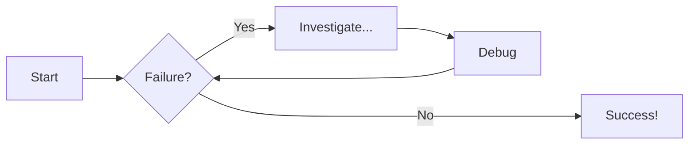
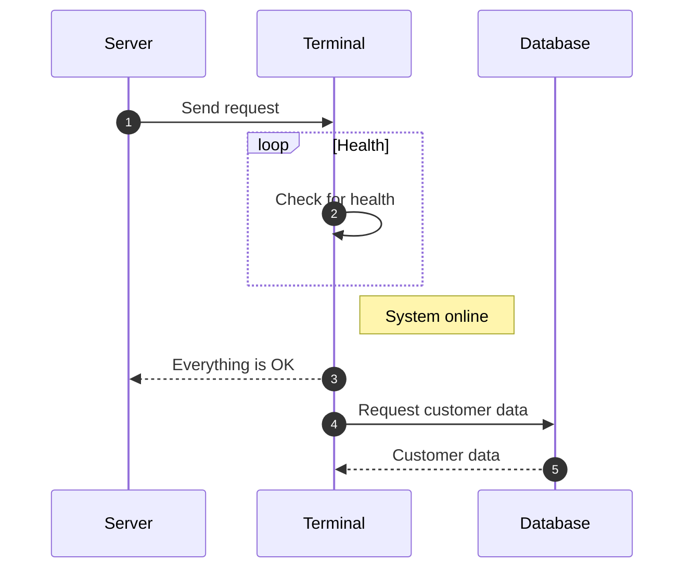

# Mkdocs Tips

[MkDocs Documentation](https://squidfunk.github.io/mkdocs-material/reference/).

## Commands

* `mkdocs serve` - Start the live-reloading docs server.

## Code Example

``` py title="example.py" linenums="1" hl_lines="2 3"
def bubble_sort(items):
    for i in range(len(items)):
        for j in range(len(items) - 1 - i):
            if items[j] > items[j + 1]:
                items[j], items[j + 1] = items[j + 1], items[j]
```

## Example of an admonition/callout with a title:

!!! note "Title of the callout"

    Lorem ipsum dolor sit amet, consectetur adipiscing elit. Nulla et euismod
    nulla. Curabitur feugiat, tortor non consequat finibus, justo purus auctor
    massa, nec semper lorem quam in massa.

Collapsible callout:

??? info "Collapsible callout"

    Lorem ipsum dolor sit amet, consectetur adipiscing elit. Nulla et euismod
    nulla. Curabitur feugiat, tortor non consequat finibus, justo purus auctor
    massa, nec semper lorem quam in massa.

## Diagram Examples

### Flowcharts



### Sequence Diagrams



## Text Styles

- ==This was marked (highlight)==
- ^^This was inserted (underline)^^
- ~~This was deleted (strikethrough)~~

## Images

<figure markdown="span">
  { width="300" }
  <figcaption>Image caption</figcaption>
</figure>